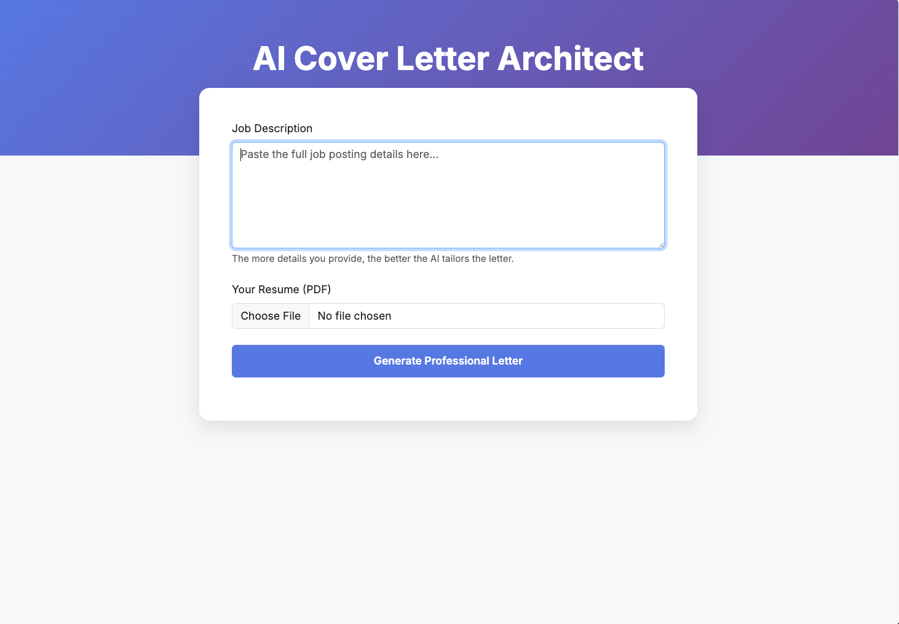
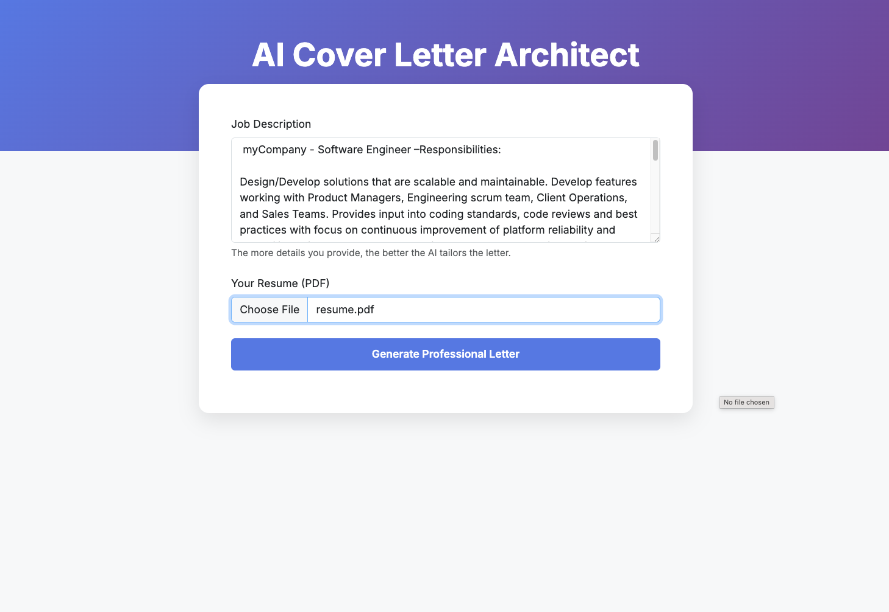
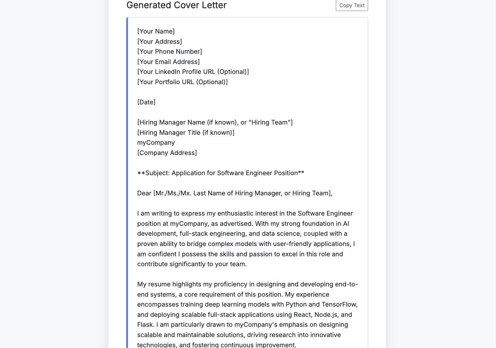

### AI Cover Letter Architect
**A Full-Stack Generative AI Tool built with Flask, LangChain, and Gemini 2.5/3.**

### 1. Purpose
In a competitive job market, generic applications are often filtered out by recruiters and Applicant Tracking Systems (ATS). The **AI Cover Letter Architect** solves "application fatigue" by bridging the gap between a static resume and a specific job posting. It analyzes your unique experience and maps it directly to job requirements in seconds, providing a high-quality starting point for any application.

### 2. Key Features
**- Intelligent PDF Parsing:** Automatically extracts and cleans text from uploaded resumes.

**- Contextual Mapping:** Uses Gemini’s advanced reasoning to align your specific achievements with job requirements.

**- Live UI Feedback:** Features a real-time "Architecting..." state to manage LLM latency and enhance user experience.

**- Instant Clipboard Export:** A one-click "Copy Text" feature for seamless pasting into application portals.

**- Security Focused:** Automatic cleanup of uploaded files and secure API environment handling via .env.

-------------------------------------------------------------------------------------------------------------------------------------

### 3. Technology Stack
**- Languages:** Python 3.13, HTML5, CSS3.

**- Framework:** Flask (Python Micro-framework).

**- AI Orchestration:** LangChain (LCEL).

**- LLM Engine:** Google Gemini 2.5/3 (Flash-Lite).

**- Frontend Library:** Bootstrap 5 (Responsive Design).

**- PDF Processing:** PyPDF2.

-------------------------------------------------------------------------------------------------------------------------------------

### 4. Prerequisites and Installation 
**Prerequisites**

**1. Python 3.10+** Installed on your machine

**2. Google Gemini API Key** **Google Gemini API Key:** Obtain one for free at [Google AI Studio](https://aistudio.google.com/).

**Installation Steps**

**1. Clone The Repository**
```bash
git clone https://github.com/carlos-marin1742/AI-cover-letter-generator.git
```

**2. Install Dependencies:**
```bash
pip install -r requirements.txt
```
**3. Configure Environment Variables:** Create ***.env*** file in the root directory
```plaintext
GOOGLE_API_KEY=your_actual_key_here
```

**4. Run the Server:**
```bash
python app.py
```
-------------------------------------------------------------------------------------------------------------------------------------

### 5. Usage & Examples
**1. Input:** Paste a Job Description from job board

**2. Upload:** Select your resume

**3. Generate:** Click "Generate Professional Letter" and watch AI architect your response

**4. Export:** Click the **Copy Text** Button to instantly save the results to your clipboard for use in your application


**Sample App images**



