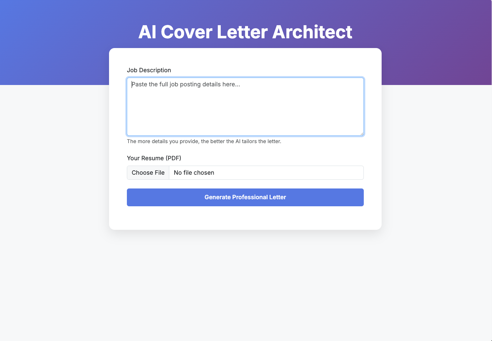
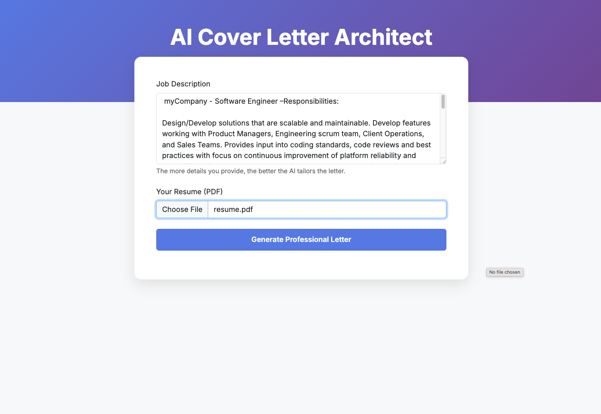
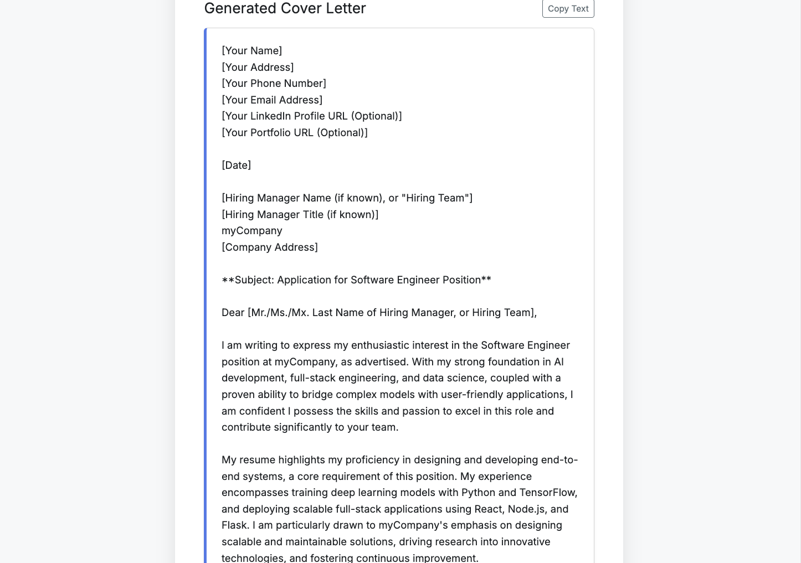

# AI Cover Letter Architect

**A Full-Stack Generative AI Tool built with Flask, LangChain, and Gemini 2.5.**

[](https://ai-cover-letter-generator-aq1h.onrender.com)
[](https://python.org)
[](https://flask.palletsprojects.com)
[](https://aistudio.google.com)

---

## 🚀 Live Demo

**Try it now:** [https://ai-cover-letter-generator-aq1h.onrender.com](https://ai-cover-letter-generator-aq1h.onrender.com)

> ⚡ Hosted on Render's free tier — may take 30–60 seconds to wake up on first visit.

---

## 1. Purpose

In a competitive job market, generic applications are often filtered out by recruiters and Applicant Tracking Systems (ATS). The **AI Cover Letter Architect** solves "application fatigue" by bridging the gap between a static resume and a specific job posting. It analyzes your unique experience and maps it directly to job requirements in seconds, providing a high-quality starting point for any application.

---

## 2. Key Features

- **Intelligent PDF Parsing:** Automatically extracts and cleans text from uploaded resumes.
- **Contextual Mapping:** Uses Gemini's advanced reasoning to align your specific achievements with job requirements.
- **Live UI Feedback:** Features a real-time "Architecting..." state to manage LLM latency and enhance user experience.
- **Instant Clipboard Export:** A one-click "Copy Text" feature for seamless pasting into application portals.
- **Security Focused:** Automatic cleanup of uploaded files and secure API environment handling via `.env`.

---

## 3. Technology Stack

| Category | Technology |
|---|---|
| Languages | Python 3.13, HTML5, CSS3 |
| Framework | Flask (Python Micro-framework) |
| AI Orchestration | LangChain (LCEL) |
| LLM Engine | Google Gemini 2.5 Flash-Lite |
| Frontend | Bootstrap 5 (Responsive Design) |
| PDF Processing | PyPDF2 |
| Deployment | Render |

---

## 4. Screenshots

**Initial Screen**


**Uploading Resume and Pasting Job Description**


**Cover Letter Generation**


---

## 5. Run Locally

### Prerequisites

1. **Python 3.10+** installed on your machine
2. **Google Gemini API Key** — obtain one for free at [Google AI Studio](https://aistudio.google.com/)

### Installation

**1. Clone the repository**
```bash
git clone https://github.com/carlos-marin1742/AI-cover-letter-generator.git
cd AI-cover-letter-generator
```

**2. Install dependencies**
```bash
pip install -r requirements.txt
```

**3. Configure environment variables** — create a `.env` file in the root directory
```plaintext
GOOGLE_API_KEY=your_actual_key_here
```

**4. Run the server**
```bash
python app.py
```

Then open [http://localhost:5000](http://localhost:5000) in your browser.

---

## 6. Usage

1. **Input** — Paste a job description from any job board
2. **Upload** — Select your resume (PDF)
3. **Generate** — Click "Generate Professional Letter" and watch AI architect your response
4. **Export** — Click the **Copy Text** button to instantly save the result to your clipboard

---

## 7. Deployment

This app is deployed on **[Render](https://render.com)** using Gunicorn as the production WSGI server.

To deploy your own instance:
- Fork this repo
- Create a new **Web Service** on Render
- Set the build command: `pip install -r requirements.txt`
- Set the start command: `gunicorn app:app`
- Add your `GOOGLE_API_KEY` as an environment variable

---

## 8. Contact

**Developer:** Carlos Marin
**Project Link:** [GitHub Repository](https://github.com/carlos-marin1742/AI-cover-letter-generator/)
**Live Demo:** [https://ai-cover-letter-generator-aq1h.onrender.com](https://ai-cover-letter-generator-aq1h.onrender.com)
